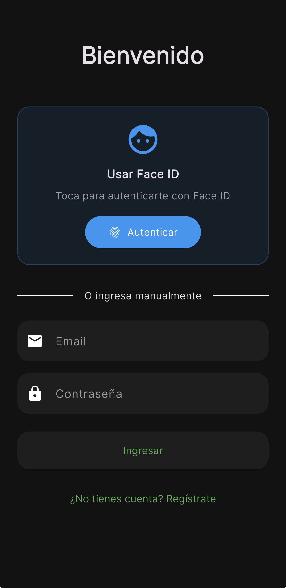
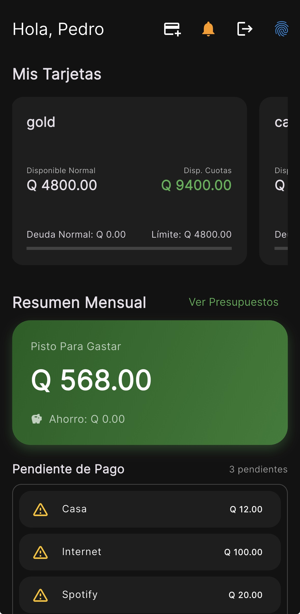
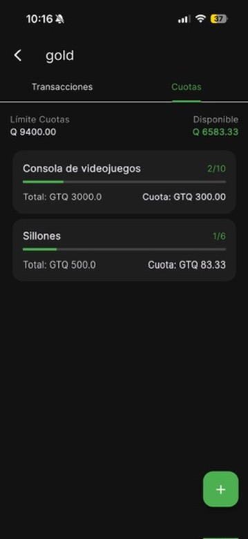
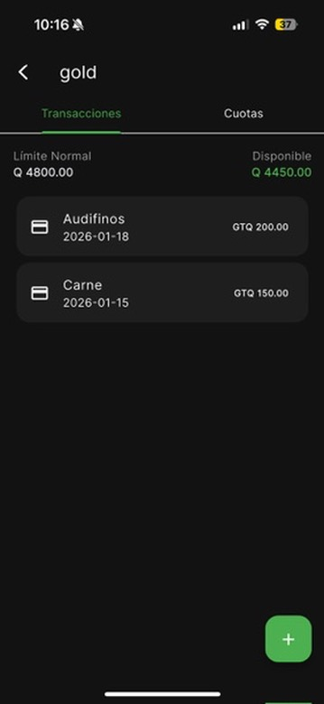
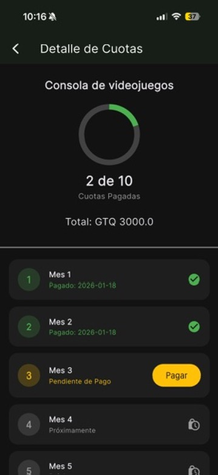
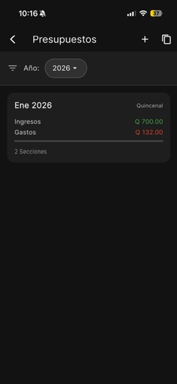

# 💰 Personal Finance App

<div align="center">
  <h3>🚀 Gestión de Finanzas Personales Inteligente</h3>
  <p>Una aplicación móvil moderna y elegante desarrollada con Flutter</p>
  
  [](https://flutter.dev)
  [](https://dart.dev)
  [](https://firebase.google.com)
</div>

---

## 📱 Vista Previa de la Aplicación

<div align="center">
  <table>
    <tr>
      <td align="center">
        
        <br><b>🔐 Login Biométrico</b>
      </td>
      <td align="center">
        
        <br><b>📊 Dashboard</b>
      </td>
      <td align="center">
        
        <br><b>💳 Cuotas</b>
      </td>
    </tr>
    <tr>
      <td align="center">
        
        <br><b>💰 Gastos</b>
      </td>
      <td align="center">
        
        <br><b>📋 Detalle</b>
      </td>
      <td align="center">
        
        <br><b>📈 Presupuestos</b>
      </td>
    </tr>
  </table>
</div>

---

Administra tus tarjetas de crédito, transacciones, cuotas y presupuestos de manera intuitiva y eficiente con nuestra aplicación de finanzas personales.

## ✨ Características Principales

### 🔐 **Autenticación Segura**
- ✅ **Login Biométrico** - Face ID / Touch ID / Huella dactilar
- ✅ **Autenticación JWT** - Tokens seguros para sesiones
- ✅ **Registro Completo** - Proceso de registro intuitivo
- ✅ **Persistencia de Sesión** - Mantiene la sesión activa

### 💳 **Gestión de Tarjetas**
- ✅ **Dashboard Intuitivo** - Vista general de todas las tarjetas
- ✅ **Detalles Completos** - Límites, balances y disponible
- ✅ **Múltiples Bancos** - Soporte para diferentes entidades
- ✅ **Gestión Visual** - Interfaz moderna y fácil de usar

### 💰 **Transacciones Inteligentes**
- ✅ **Agregar Gastos** - Registro rápido de transacciones
- ✅ **Planes de Cuotas** - Compras a plazos con cálculo automático
- ✅ **Estados de Pago** - Control visual de pagos pendientes
- ✅ **Historial Detallado** - Seguimiento completo de movimientos

### 📊 **Presupuestos Dinámicos**
- ✅ **Presupuestos Mensuales** - Planificación por mes y año
- ✅ **Secciones Personalizables** - Ingresos, gastos y ahorros
- ✅ **Seguimiento en Tiempo Real** - Progreso visual del presupuesto
- ✅ **Gastos Interactivos** - Agregar y marcar gastos como pagados

### 🎨 **Experiencia de Usuario**
- ✅ **Diseño Material** - Interfaz moderna y consistente
- ✅ **Tema Oscuro** - Diseño elegante y cómodo para la vista
- ✅ **Animaciones Fluidas** - Transiciones suaves y naturales
- ✅ **Responsive Design** - Adaptable a diferentes tamaños

### 📱 **Notificaciones**
- ✅ **Push Notifications** - Alertas en tiempo real
- ✅ **Firebase Integration** - Notificaciones confiables
- ✅ **Recordatorios** - Fechas de pago y vencimientos

## 🛠️ Stack Tecnológico

<div align="center">
  <table>
    <tr>
      <td align="center" width="25%">
        
        <br><b>Framework</b>
      </td>
      <td align="center" width="25%">
        
        <br><b>Lenguaje</b>
      </td>
      <td align="center" width="25%">
        
        <br><b>Estado</b>
      </td>
      <td align="center" width="25%">
        
        <br><b>Backend</b>
      </td>
    </tr>
  </table>
</div>

### 🏗️ **Arquitectura**
- **Flutter** - Framework multiplataforma de Google
- **Dart** - Lenguaje de programación optimizado
- **Provider** - Gestión de estado reactiva y eficiente
- **Material Design** - Componentes de diseño modernos

### 🔗 **Networking & APIs**
- **Dio** - Cliente HTTP potente y flexible
- **REST API** - Comunicación con backend Node.js
- **JWT Authentication** - Autenticación segura

### 🔒 **Seguridad**
- **Flutter Secure Storage** - Almacenamiento seguro de tokens
- **Local Auth** - Autenticación biométrica nativa
- **Environment Variables** - Configuración segura

### 🎨 **UI/UX**
- **Google Fonts** - Tipografías modernas
- **Custom Themes** - Temas personalizados elegantes
- **Responsive Design** - Adaptable a todas las pantallas

## 📋 Requisitos Previos

- **Flutter SDK** >= 3.10.1
- **Dart SDK** >= 3.10.1
- **Android Studio** / **Xcode** (para desarrollo nativo)
- **Firebase Project** (para notificaciones)

### Plataformas Soportadas
- ✅ **Android** (API 21+)
- ✅ **iOS** (iOS 12+)
- ✅ **Web** (Experimental)
- ✅ **Windows** (Experimental)
- ✅ **macOS** (Experimental)
- ✅ **Linux** (Experimental)

## ⚡ Instalación Rápida

### 📋 **Requisitos Previos**
```bash
# Verificar instalación de Flutter
flutter doctor
```

**Requisitos del Sistema:**
- ✅ **Flutter SDK** >= 3.10.1
- ✅ **Dart SDK** >= 3.10.1
- ✅ **Android Studio** / **Xcode**
- ✅ **Firebase Project** (opcional)

### 🚀 **Pasos de Instalación**

#### 1️⃣ **Clonar y Configurar**
```bash
# Clonar el repositorio
git clone <repository-url>
cd front

# Instalar dependencias
flutter pub get
```

#### 2️⃣ **Variables de Entorno**
```bash
# Copiar archivo de ejemplo
cp .env.example .env
```

Edita `.env` con tus configuraciones:
```env
# API Backend
API_BASE_URL=http://localhost:3000/api
API_TIMEOUT=30000

# Firebase (opcional)
FIREBASE_PROJECT_ID=tu-proyecto-firebase

# App Info
APP_NAME=Personal Finance
APP_VERSION=1.0.0
```

#### 3️⃣ **Configurar Firebase** (Opcional)
<details>
<summary>📱 <b>Android</b></summary>

1. Descarga `google-services.json` desde Firebase Console
2. Colócalo en `android/app/`
</details>

<details>
<summary>🍎 <b>iOS</b></summary>

1. Descarga `GoogleService-Info.plist` desde Firebase Console
2. Colócalo en `ios/Runner/`
</details>

#### 4️⃣ **Ejecutar la App**
```bash
# Modo desarrollo
flutter run

# Modo release
flutter run --release

# Plataforma específica
flutter run -d android    # Android
flutter run -d ios        # iOS
flutter run -d chrome     # Web
```

### 🎯 **Plataformas Soportadas**
<div align="center">
  <table>
    <tr>
      <td align="center">📱 <b>Android</b><br>API 21+</td>
      <td align="center">🍎 <b>iOS</b><br>iOS 12+</td>
      <td align="center">🌐 <b>Web</b><br>Chrome, Safari</td>
      <td align="center">🖥️ <b>Desktop</b><br>Windows, macOS, Linux</td>
    </tr>
  </table>
</div>

## 📁 Estructura del Proyecto

```
front/
├── lib/
│   ├── config/             # Configuraciones
│   │   ├── app_colors.dart # Colores del tema
│   │   └── app_theme.dart  # Tema de la aplicación
│   ├── models/             # Modelos de datos
│   │   ├── budget.dart     # Modelo de presupuesto
│   │   ├── credit_card.dart# Modelo de tarjeta
│   │   ├── transaction.dart# Modelo de transacción
│   │   └── installment.dart# Modelo de cuota
│   ├── providers/          # Gestión de estado
│   │   ├── auth_provider.dart    # Autenticación
│   │   ├── card_provider.dart    # Tarjetas
│   │   └── budget_provider.dart  # Presupuestos
│   ├── screens/            # Pantallas de la app
│   │   ├── dashboard_screen.dart      # Dashboard principal
│   │   ├── login_screen.dart          # Inicio de sesión
│   │   ├── card_detail_screen.dart    # Detalle de tarjeta
│   │   ├── budget_detail_screen.dart  # Detalle de presupuesto
│   │   └── ...                        # Otras pantallas
│   ├── services/           # Servicios
│   │   ├── http_service.dart          # Cliente HTTP
│   │   ├── storage_service.dart       # Almacenamiento
│   │   └── notification_service.dart  # Notificaciones
│   ├── utils/              # Utilidades
│   ├── widgets/            # Widgets reutilizables
│   ├── firebase_options.dart # Configuración Firebase
│   └── main.dart           # Punto de entrada
├── android/                # Configuración Android
├── ios/                    # Configuración iOS
├── web/                    # Configuración Web
├── assets/                 # Recursos (imágenes, iconos)
├── pubspec.yaml           # Dependencias y configuración
└── .env                   # Variables de entorno
```

## 🎯 Funcionalidades Detalladas

### 🔐 **Autenticación Biométrica**


- **Login Seguro** - Autenticación con Face ID, Touch ID o huella dactilar
- **Registro Completo** - Proceso de alta intuitivo y rápido
- **Persistencia** - Mantiene la sesión activa de forma segura
- **Tokens JWT** - Autenticación robusta con el backend

<br clear="right"/>

### 📊 **Dashboard Inteligente**


- **Vista General** - Resumen de todas las tarjetas y balances
- **Indicadores Visuales** - Gráficos y barras de progreso
- **Accesos Rápidos** - Navegación intuitiva a todas las funciones
- **Información en Tiempo Real** - Datos actualizados automáticamente

<br clear="right"/>

### 💳 **Gestión de Tarjetas y Cuotas**


- **Lista Completa** - Todas tus tarjetas organizadas
- **Detalles Precisos** - Límites, deudas y disponible
- **Planes de Cuotas** - Compras a plazos con cálculo automático
- **Control de Pagos** - Seguimiento de cuotas pendientes y pagadas

<br clear="right"/>

### 💰 **Transacciones y Gastos**


- **Agregar Gastos** - Formulario rápido y sencillo
- **Dos Modalidades** - Gastos normales o planes de cuotas
- **Fechas Flexibles** - Selector de fechas intuitivo
- **Validación Inteligente** - Formularios con validación en tiempo real

<br clear="right"/>

### 📋 **Detalles de Cuotas**


- **Información Completa** - Detalles de cada plan de cuotas
- **Progreso Visual** - Cuotas pagadas vs pendientes
- **Gestión Individual** - Marcar cuotas como pagadas
- **Historial Detallado** - Seguimiento completo de pagos

<br clear="right"/>

### 📈 **Presupuestos Dinámicos**


- **Planificación Mensual** - Presupuestos por mes y año
- **Secciones Personalizables** - Ingresos, gastos y ahorros
- **Seguimiento en Vivo** - Progreso visual del presupuesto
- **Gastos Interactivos** - Agregar y gestionar gastos fácilmente

<br clear="right"/>

## 🚀 Scripts y Comandos

### 🛠️ **Desarrollo**
```bash
# Ejecutar en modo debug
flutter run

# Hot reload automático (ya incluido)
# Presiona 'r' para hot reload
# Presiona 'R' para hot restart

# Ejecutar tests
flutter test

# Analizar código
flutter analyze
```

### 📦 **Build y Release**
```bash
# Android APK
flutter build apk --release

# Android Bundle (recomendado para Play Store)
flutter build appbundle --release

# iOS
flutter build ios --release

# Web
flutter build web --release
```

### 🧹 **Utilidades**
```bash
# Limpiar proyecto
flutter clean

# Obtener dependencias
flutter pub get

# Actualizar dependencias
flutter pub upgrade

# Generar iconos de la app
flutter pub run flutter_launcher_icons:main
```

## 🎨 Personalización

### Colores y Tema
Edita `lib/config/app_colors.dart` para personalizar colores:

```dart
class AppColors {
  static const Color primary = Color(0xFF6366F1);
  static const Color secondary = Color(0xFF8B5CF6);
  static const Color background = Color(0xFF0F172A);
  // ... más colores
}
```

### Configuración de Firebase
1. Crea un proyecto en [Firebase Console](https://console.firebase.google.com)
2. Agrega tu app Android/iOS
3. Descarga los archivos de configuración
4. Habilita Firebase Messaging para notificaciones

## 📱 Capturas de Pantalla

### Dashboard Principal
- Vista general de tarjetas y balances
- Accesos rápidos a funcionalidades
- Diseño moderno y elegante

### Gestión de Tarjetas
- Lista completa de tarjetas
- Detalles con transacciones
- Formularios intuitivos

### Presupuestos
- Creación y edición de presupuestos
- Seguimiento visual de gastos
- Progreso en tiempo real

## 🔧 Configuración Avanzada

### Android
- **Minimum SDK**: 21 (Android 5.0)
- **Target SDK**: 34 (Android 14)
- **Permissions**: Internet, Biometric, Notifications

### iOS
- **Minimum Version**: iOS 12.0
- **Permissions**: Biometric, Notifications
- **Capabilities**: Push Notifications

## 🤝 Contribución

1. Fork el proyecto
2. Crea una rama para tu feature (`git checkout -b feature/AmazingFeature`)
3. Commit tus cambios (`git commit -m 'Add some AmazingFeature'`)
4. Push a la rama (`git push origin feature/AmazingFeature`)
5. Abre un Pull Request

### Estándares de Código
- Seguir las convenciones de Dart/Flutter
- Usar `flutter analyze` antes de commit
- Documentar funciones públicas
- Mantener consistencia en el estilo

## 📝 Licencia

Este proyecto está bajo la Licencia MIT. Ver el archivo `LICENSE` para más detalles.

## 👨‍💻 Autor

**Damian Garcia** - Desarrollador Full Stack

---

## 🆘 Soporte y Troubleshooting

### Problemas Comunes

#### Error de Dependencias
```bash
flutter clean
flutter pub get
```

#### Problemas de Build
```bash
cd android
./gradlew clean
cd ..
flutter build apk
```

#### Problemas de iOS
```bash
cd ios
pod install
cd ..
flutter build ios
```

### Logs y Debug
```bash
# Ver logs detallados
flutter run --verbose

# Logs de dispositivo
flutter logs
```

¡Gracias por usar Personal Finance App! 🚀

## 🆘 Soporte y Troubleshooting

<details>
<summary>🔧 <b>Problemas Comunes</b></summary>

### ❌ Error de Dependencias
```bash
flutter clean
flutter pub get
```

### ❌ Problemas de Build Android
```bash
cd android
./gradlew clean
cd ..
flutter build apk
```

### ❌ Problemas de iOS
```bash
cd ios
pod install
cd ..
flutter build ios
```

### ❌ Error de Gradle
Si tienes problemas con Gradle, verifica:
- Java JDK 17+ instalado
- Variables de entorno JAVA_HOME
- Conexión a internet estable

</details>

<details>
<summary>📊 <b>Logs y Debug</b></summary>

```bash
# Ver logs detallados
flutter run --verbose

# Logs de dispositivo
flutter logs

# Información del sistema
flutter doctor -v
```

</details>

<details>
<summary>🔥 <b>Firebase Setup</b></summary>

1. Crear proyecto en [Firebase Console](https://console.firebase.google.com)
2. Agregar app Android/iOS
3. Descargar archivos de configuración
4. Habilitar Authentication y Messaging
5. Configurar reglas de seguridad

</details>

---

## 🤝 Contribución

¿Quieres contribuir? ¡Genial! Sigue estos pasos:

1. 🍴 **Fork** el proyecto
2. 🌿 **Crea** una rama (`git checkout -b feature/AmazingFeature`)
3. 💾 **Commit** tus cambios (`git commit -m 'Add AmazingFeature'`)
4. 📤 **Push** a la rama (`git push origin feature/AmazingFeature`)
5. 🔄 **Abre** un Pull Request

### 📝 **Estándares de Código**
- Seguir convenciones de Dart/Flutter
- Usar `flutter analyze` antes de commit
- Documentar funciones públicas
- Mantener consistencia en el estilo

---

## 📄 Licencia

Este proyecto está bajo la **Licencia MIT**. Ver el archivo `LICENSE` para más detalles.

---

## 👨‍💻 Autor

<div align="center">
  <h3>🚀 Damian Garcia</h3>
  <p><i>Desarrollador Full Stack</i></p>
  
  [](https://github.com/JosDamQ)
  [](https://linkedin.com/in/josuegarciada)
</div>

---

## 🔄 Roadmap

### 🎯 **Próximas Funcionalidades**
- [ ] 🌙 Modo oscuro/claro dinámico
- [ ] 📄 Exportar reportes PDF
- [ ] 📊 Gráficos avanzados y analytics
- [ ] ☁️ Sincronización en la nube
- [ ] 💱 Soporte para múltiples monedas
- [ ] 🏷️ Categorías personalizadas de gastos

### 🔧 **Mejoras Técnicas**
- [ ] ✅ Tests unitarios completos
- [ ] 🔄 Tests de integración
- [ ] 🚀 CI/CD pipeline
- [ ] ⚡ Optimización de rendimiento
- [ ] ♿ Accesibilidad mejorada

---

<div align="center">
  <h3>⭐ ¡Si te gusta el proyecto, dale una estrella! ⭐</h3>
  <p><i>¡Gracias por usar Personal Finance App! 🚀</i></p>
</div>